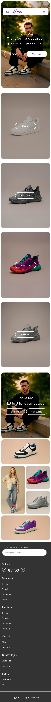

# SyntaxWear - Tênis e Sneakers Online

SyntaxWear é um site de e-commerce de página única para venda de tênis e sneakers. O projeto foi desenvolvido com HTML e CSS puros, seguindo uma abordagem de componentização para o estilo.

## 🚀 Demonstração

### 💻 Desktop 


### 📱 Mobile



## 📋 Funcionalidades

- **Layout Responsivo**: O site se adapta a diferentes tamanhos de tela, de dispositivos móveis a desktops.
- **Componentes de Estilo**: O CSS é organizado em componentes, facilitando a manutenção e o reuso de estilos.
- **Navegação Intuitiva**: O site possui um menu de navegação claro e conciso.

## Folder Structure

A estrutura de pastas do projeto é a seguinte:

```
/
├── css/
│   ├── base.css
│   ├── reset.css
│   ├── variables.css
│   └── components/
│       ├── footer.css
│       ├── header.css
│       ├── hero.css
│       ├── product-category.css
│       └── product-grid.css
├── images/
│   ├── banners/
│   ├── favicon/
│   ├── icons/
│   ├── logo/
│   └── products/
├── index.html
└── README.md
```

## 🛠️ Tecnologias Utilizadas

- **HTML5**: Para a estrutura do site.
- **CSS3**: Para a estilização do site, com uma abordagem de componentização.

## 🏃‍♀️ Como Executar

Para visualizar o site, basta abrir o arquivo `index.html` em seu navegador de preferência.

1.  **Clone o repositório:**

    ```bash
    git clone https://github.com/Samuel-Scheidt-Cunha/e-commerce-syntaxwear.git
    ```

2.  **Abra o `index.html`:**

    Navegue até a pasta do projeto e abra o arquivo `index.html` em seu navegador.

```
